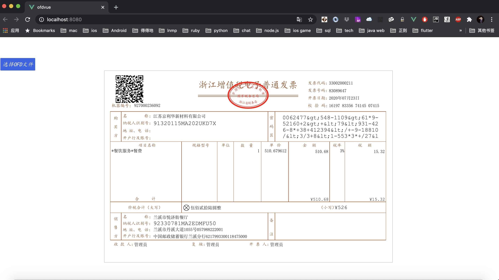

# ofd.js

### 在使用ofd.js前请务必悉知  [《ofd.js免责声明》](https://github.com/DLTech21/ofd.js/blob/master/%E5%85%8D%E8%B4%A3%E5%A3%B0%E6%98%8E.md)

 [](./LICENSE)

目前方案采用：svg及canvas渲染实现，百分百纯前端渲染

效果： 


[体验地址](https://51shouzu.xyz/ofd/)

## Usage with npm

```
npm i ofd.js
```

```
import {parseOfdDocument, renderOfd} from "ofd.js";
```

```
其中ofd传入的file支持本地文件、二进制或者url、screenWidth为屏幕宽度
parseOfdDocument({
        ofd: file,
        success(res) {
          //输出ofd每页的div
          const divs = renderOfd(screenWidth, res);
          //获取签章div的信息, 具体看demo
          for(let ele of document.getElementsByName('seal_img_div')) {
             this.addEventOnSealDiv(ele, JSON.parse(ele.dataset.sesSignature), JSON.parse(ele.dataset.signedInfo));
          }
        },
        fail(error) {
          console.log(error)
        }
      });
```

## 服务接口

### OFD转PDF

URL：http://donal-tong.ticp.io/api/ofd/convertPdf

请求方式：POST

报文格式：Content-Type: application/json

请求参数：

| 参数        | 说明                                                         | 类型    | 是否必填 |
| ----------- | ------------------------------------------------------------ | ------- | -------- |
| ofdBase64   | 待转换的OFD版式文件，BASE64编码的字符串                  | String  | 是       |


请求参数示例：

```json
{
    "ofdBase64":"{{ofdBase64}}"
}
```

返回数据：

| 数据    | 说明                                                   |
| ------- | ------------------------------------------------------ |
| code    | 返回码。"0"表示成功，其余表示失败，失败原因参考message |
| message | 请求结果信息                                           |
| data    | 转后的pdf文件，BASE64编码的字符串            |

返回数据示例：

```json
{
	"code": "0",
	"data": "xxx",
	"message": "成功"
}
```

### PDF转OFD

URL：http://donal-tong.ticp.io/api/ofd/convertOfd

请求方式：POST

报文格式：Content-Type: application/json

请求参数：

| 参数        | 说明                                                         | 类型    | 是否必填 |
| ----------- | ------------------------------------------------------------ | ------- | -------- |
| pdfBase64   | 待转换的Pdf，BASE64编码的字符串                  | String  | 是       |


请求参数示例：

```json
{
    "pdfBase64":"{{pdfBase64}}"
}
```

返回数据：

| 数据    | 说明                                                   |
| ------- | ------------------------------------------------------ |
| code    | 返回码。"0"表示成功，其余表示失败，失败原因参考message |
| message | 请求结果信息                                           |
| data    | 转后的ofd文件，BASE64编码的字符串            |

返回数据示例：

```json
{
	"code": "0",
	"data": "xxx",
	"message": "成功"
}
```

## 愿景
希望能做到pdf.js的高度

## ofd推荐项目
[OFD Reader & Writer](https://github.com/Trisia/ofdrw)

## 参与贡献
发挥人人为我，我为人人的优良传统，多做pr~~~

## Project setup
```
npm install
```

### Compiles and hot-reloads for development
```
npm run serve
```

### Compiles and minifies for production
```
npm run build
```

### Lints and fixes files
```
npm run lint
```

### Customize configuration
See [Configuration Reference](https://cli.vuejs.org/config/).

### 项目关注度

> 项目获得 Star曲线

[](https://starchart.cc/DLTech21/ofd.js)
