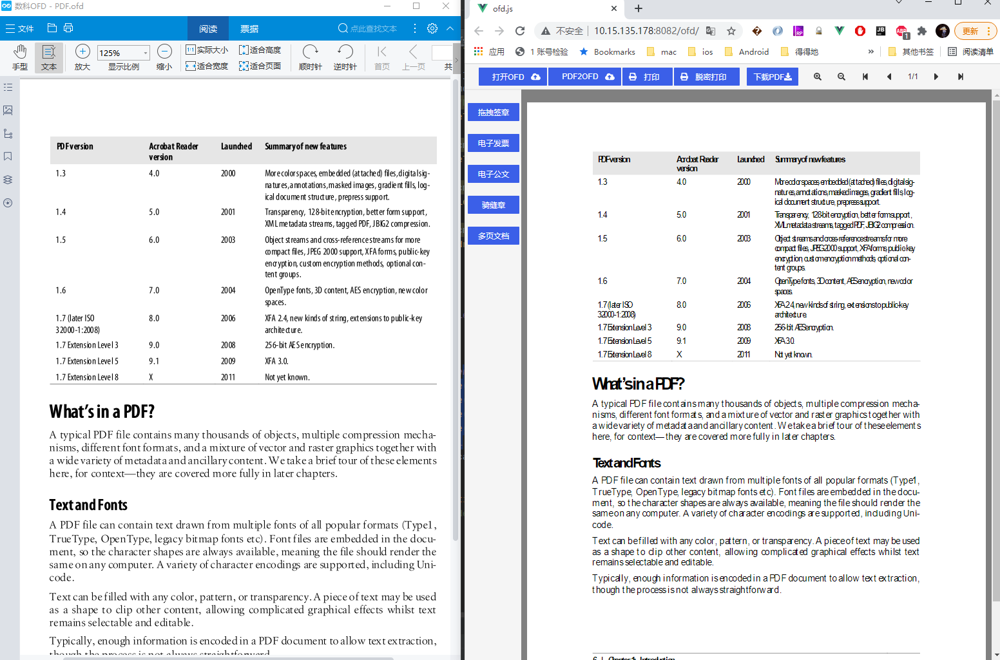
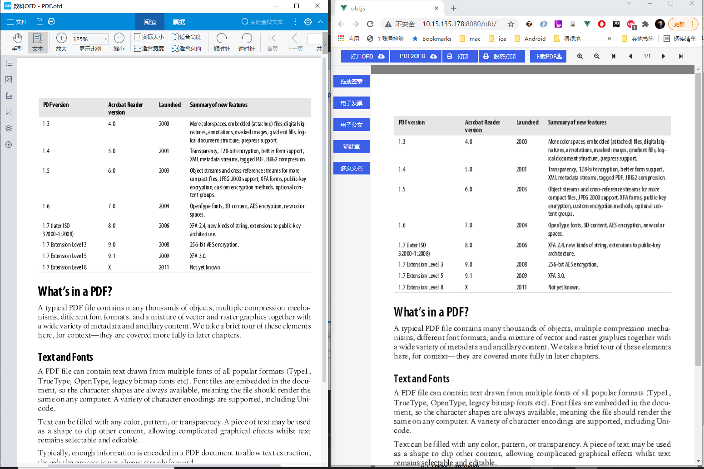

# ofd.js

 [](./LICENSE)

> 目前方案采用 wasm 实现 ofd 解析、渲染、验签，不支持 IE。<br>
> 另外可以提供各平台（Android/iOS）静态/动态库、wasm。

效果：


[体验地址](https://51shouzu.xyz/ofd/)

## Usage with npm

```sh
npm i ofd.js
```

```js
import { parseOfdDocument, renderOfd } from "ofd.js"

// 传入的 file 支持本地文件、二进制或者 url
// screenWidth 为屏幕宽度
parseOfdDocument({
  ofd: file,
  success(res) {
    // 输出 ofd 每页的 div
    const divs = renderOfd(screenWidth, res);
    // 获取签章 div 的信息, 具体看 demo
    for(let ele of document.getElementsByName('seal_img_div')) {
      this.addEventOnSealDiv(ele, JSON.parse(ele.dataset.sesSignature), JSON.parse(ele.dataset.signedInfo));
    }
  },
  fail(error) {
    console.log(error)
  }
});
```
## 愿景
希望能做到 pdf.js 的高度

## 关于内置字体方案

目前开源版本并没有解决内置字体的渲染问题，效果如下，可以看到内容排版跟正常 OFD 显示是不一致，甚至也有乱码的出现



采取 freetype 进行对内置字体进一步处理后即解决，此方案不支持 IE 浏览器



### 获取帮助

如需获取帮助可以扫码加微信或者知识星球


### 微信小程序体验 OFD


## ofd 推荐项目
[OFD Reader & Writer](https://github.com/Trisia/ofdrw)

## 参与贡献
发挥人人为我，我为人人的优良传统，多做 pr~~~

## Project setup
```
npm install
```

### Compiles and hot-reloads for development
```
npm run serve
```

### Compiles and minifies for production
```
npm run build
```

### Lints and fixes files
```
npm run lint
```

### Customize configuration
See [Configuration Reference](https://cli.vuejs.org/config/).

### 项目关注度

> 项目 Star 曲线

[](https://starchart.cc/DLTech21/ofd.js)
